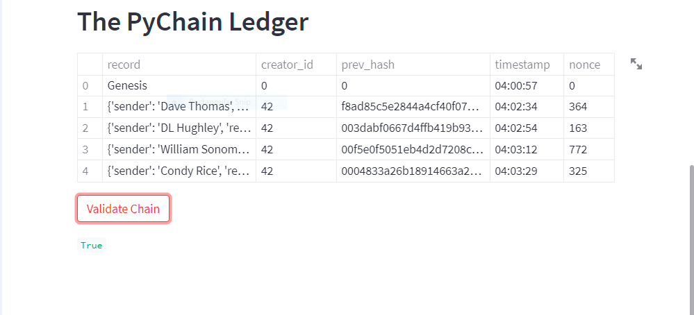
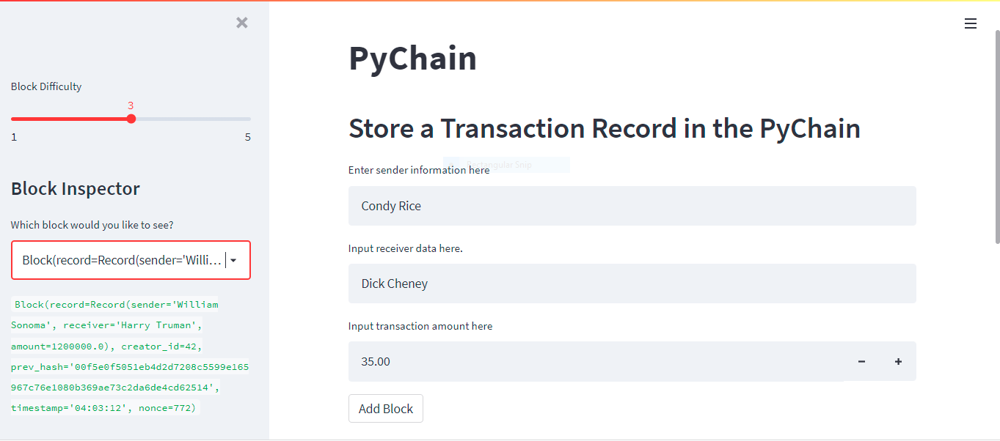

# Basic Blockchain Ledger
creating a simple, verifiable blockchain ledger with a ui generated by Streamlit
## Technologies

In this project we are utilizing Python 3 and Streamlit
Streamlit -- Open source framework to convert python scripts into shareable web apps
## Installation Guide

* Streamlit -- install via Pypi --  
 `pip install streamlit` in the command line
## Usage

In order to test the functionality of this project, the process is very straight forward.  Simply navigate to the root directory in the command line and then type `streamlit run pychain.py`.  This will spin up the script and launch the streamlit app in your browser.  Screenshots of the Streamlit app after adding blocks to the ledger and verifying the integrity of the blockchain below --  

**The ledger after adding blocks**
  

**Verifying the intergrity of the blockchain in the Streamlit app**  
  

**We can also inspect individual blocks and adjust the proof of work difficulty in mining the blocks**  
  